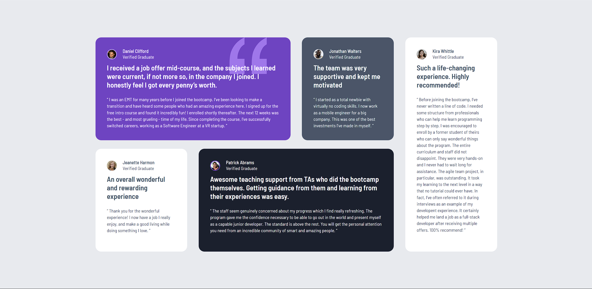

# Frontend Mentor - Testimonials grid section solution

## Table of contents

- [Overview](#overview)
  - [The challenge](#the-challenge)
  - [Screenshot](#screenshot)
  - [Links](#links)
- [My process](#my-process)
  - [Built with](#built-with)
  - [What I learned](#what-i-learned)
  - [Continued development](#continued-development)
- [Author](#author)

## Overview

### The challenge

Users should be able to:

- View the optimal layout for the site depending on their device's screen size

### Screenshot

### Links

- Solution URL: [Add solution URL here](https://your-solution-url.com)
- Live Site URL: [Add live site URL here](https://your-live-site-url.com)

## My process

### Built with

- Semantic HTML5 markup
- CSS custom properties
- Flexbox
- CSS Grid

### What I learned

Seen as a project with different elements to be placed, I tried to look for a way to think the best structure for the HTML and apply any changes needed as the project progressed. While with CSS encountering the best styling and figuring out the best breakpoints to have a more a fluid, responsive design across multiple devices, complying with the WCAG standards.

### Continued development

Will practice more complex layouts to keep developing my skills and find better ways to approach a new project from the beginning. Observe better ways to achieve same results with less amount of code (if possible), being more efficient.

## Author

- Website - [GitHub](https://github.com/winceh7)
- Frontend Mentor - [@winceh7](https://www.frontendmentor.io/profile/winceh7)